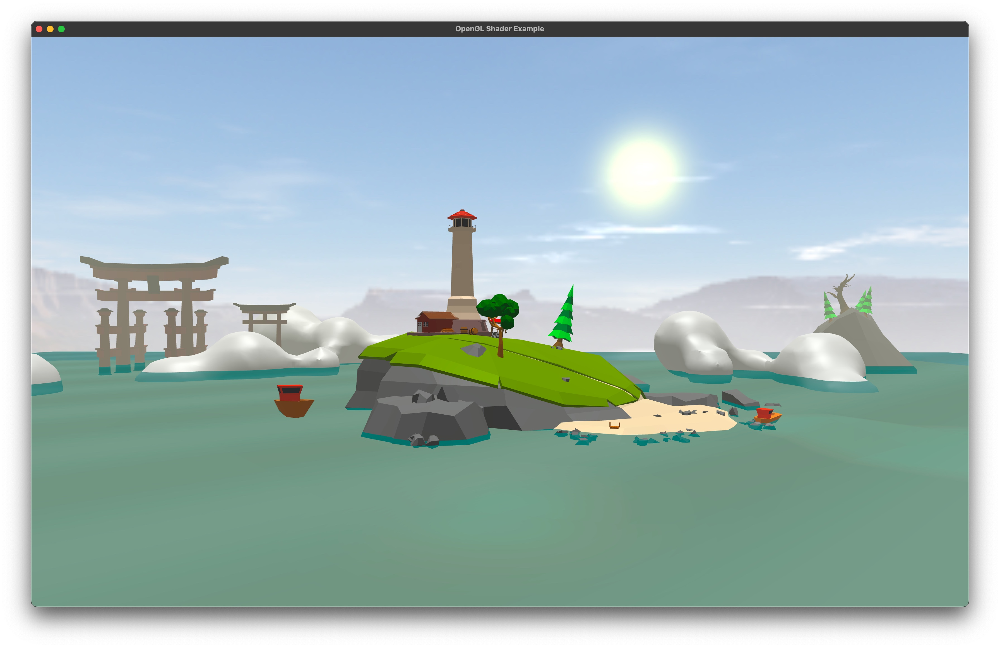

# Interactive 3D Island Scene

An OpenGL-based 3D interactive graphics application featuring a detailed island environment with dynamic elements, lighting effects, and user-controlled navigation.

## Overview

This project implements a 3D scene of an island with multiple interactive elements using modern OpenGL techniques. The scene includes animated boats, water simulation, dynamic lighting, and atmospheric effects that create a visually immersive environment.



## Features

- **Dynamic 3D Environment**: Detailed island with lighthouse, trees, fountains, and Japanese torii gates
- **Water Simulation**: Realistic water rendering with wave animations and reflections
- **Dynamic Elements**:
  - Animated boats that realistically bob and tilt on water
  - Rotating spotlight in lighthouse 
  - Day/night cycle transitions
- **Atmospheric Effects**:
  - Customizable fog density
  - Skybox with multiple environment options (day, sunset, night)
  - Blinn-Phong lighting model for realistic surfaces
- **Camera Controls**:
  - Free navigation with mouse and keyboard
  - Automated presentation mode with spiral camera path
- **Visualization Modes**:
  - Solid, wireframe, and point rendering modes
  - Shadow mapping visualization

## Dependencies

- OpenGL 4.1+
- GLFW
- GLM (OpenGL Mathematics)
- stb_image
- tiny_obj_loader

## Controls

### Camera Navigation
- **W, A, S, D**: Move camera forward, left, backward, right
- **Mouse**: Look around
- **P**: Toggle automatic presentation mode
- **Arrow Keys**: Adjust presentation speed and radius (when in presentation mode)

### Visual Effects
- **L**: Toggle light color and skybox type
- **N**: Toggle day/night mode
- **F**: Toggle fog effect
- **G/H**: Increase/decrease fog density
- **M**: Show/hide depth map

### Rendering Modes
- **1**: Wireframe mode
- **2**: Point mode
- **3**: Solid mode
- **ESC**: Exit application

## Project Structure

```
.
├── main.cpp            # Main application entry point
├── Camera.*            # Camera handling and movement
├── Mesh.*              # 3D object mesh handling
├── Model3D.*           # Model loading and management
├── Shader.*            # Shader program management
├── SkyBox.*            # Skybox implementation
├── shaders/            # GLSL shader files
│   ├── basic.*         # Main rendering shaders
│   ├── water.*         # Water simulation shaders
│   ├── skyboxShader.*  # Skybox rendering
│   └── depth.*         # Shadow mapping
├── m_scene/            # Main scene models and textures
├── m_boat/             # Boat models and textures
└── skybox/             # Skybox textures
```

## Implementation Details

- Built with C++ and modern OpenGL
- Uses GLM for mathematical operations
- Implements multiple shader programs for different visual effects
- Utilizes vertex buffer objects (VBOs) and vertex array objects (VAOs) for efficient rendering
- Features a modular class-based architecture for extensibility

## Building and Running

```bash
# Clone the repository
git clone https://github.com/yourusername/interactive-3d-island-scene.git
cd interactive-3d-island-scene

# Build using CMake
mkdir build
cd build
cmake ..
make

# Run the application
./main
```

## Future Development

- Complete shadow implementation
- Weather simulation (rain, wind effects)
- Enhanced water reflections
- Physics-based collision detection
- Audio integration
- Performance optimizations
- GUI for parameter adjustments

## Credits

Developed by Liviu Tcaci as part of the Computer Graphics course at Technical University of Cluj-Napoca.
